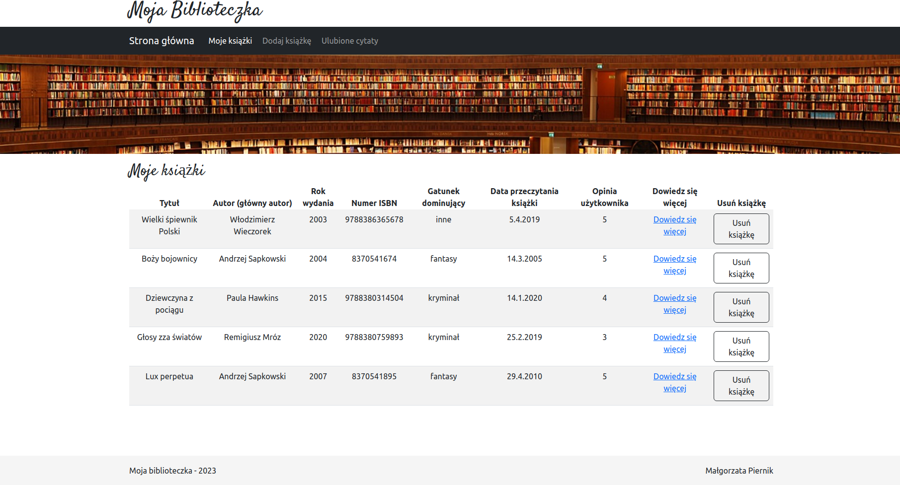

# Hello to MyBooks application!

## General info

This application os dedicated to people who love reading books. In app you can create your own library, and save your favourite quotations.

Back-end repository: https://github.com/GosiekPiernik/my-books-back

## Available Scripts

In the project directory, you can run:

### `npm start`

Open [http://localhost:3000](http://localhost:3000) to view it in the browser.

## Technologies:

- bootstrap: 5.2.3,
- customize-cra: 1.0.0,
- react: 18.2.0,
- react-app-rewired: 2.2.1,
- react-bootstrap: 2.7.2,
- react-dom: 18.2.0,
- react-router-dom: 6.9.0,
- react-scripts: 5.0.1,
- typescript: 4.9.5,
- web-vitals: 2.1.4

## Inspiration
megak.pl
